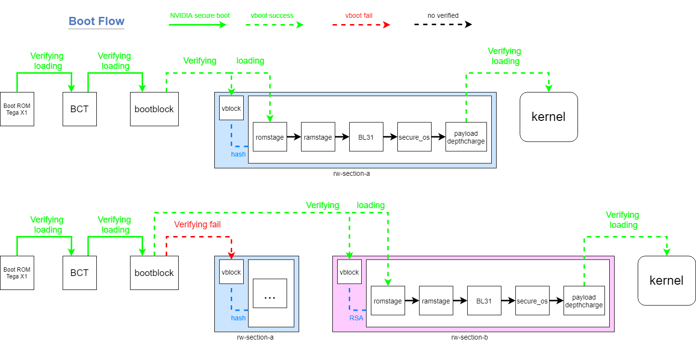
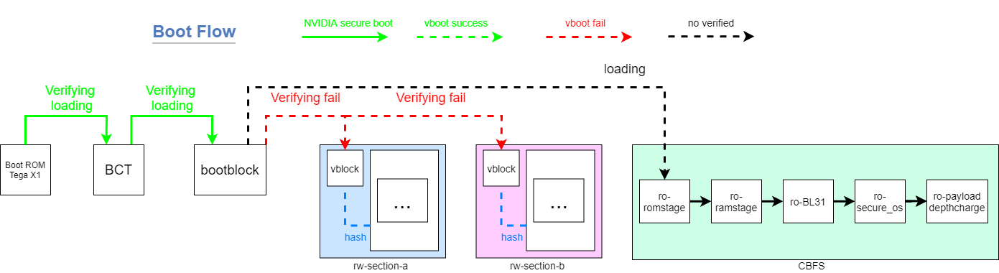
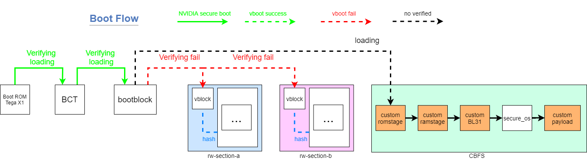

# Pixel-C_custom_bootloader
custom bootloader for google Pixel C

[HOW TO MAKE](./HOW-TO-MAKE.md)

## Boot flow - normal
Boot normal A | B .
    
## Boot flow - recovery
Boot official recovery mode.
    
## So we can breaked the vblock to boot anything
Boot flow look like that.
    